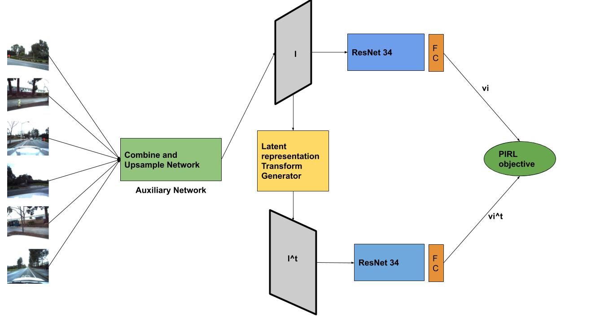
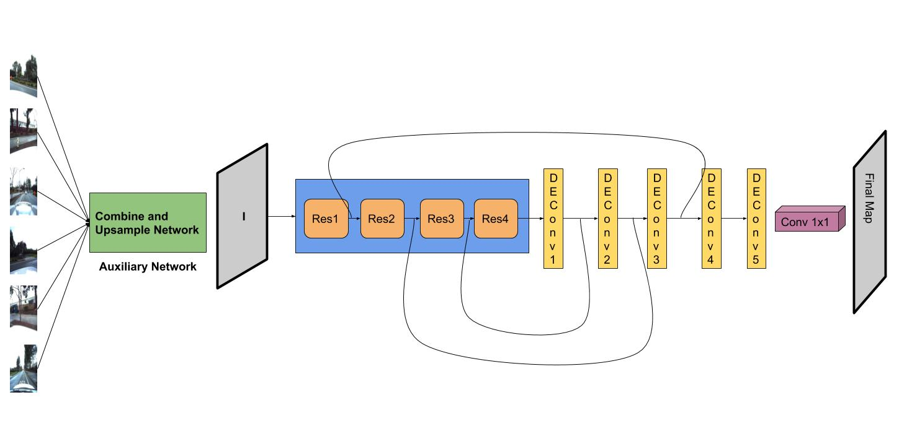

# Deep Learning Class Final Project

In this project, we explored the application of self supervised learning, in particular, Pretext
Invariant Representation Learning, as a pretext learning task for object detection and road map
segmentation problem in the domain of autonomous driving.

## Self supervision task (Pretext Invariant Representation Learning - PIRL)
We provide the block diagram for PIRL pipeline followed by us below:


To run the PIRL pipeline (from scratch) following command can be executed
```
python pirl_auto_train_test.py --model-type 'res34' --batch-size 16 --epochs 32  --lr 0.1 --tmax-for-cos-decay 60 
--count-negatives 6400 --only-train True --experiment-name e1_pirl_auto_drive
```

To run the PIRL pipeline (in continuation to previous trained version) following command can be executed
```
python pirl_auto_train_test.py --model-type 'res34' --batch-size 16 --epochs 32  --lr 0.1 --tmax-for-cos-decay 60 
--count-negatives 6400 --only-train True --prev-trained-aux-file <prev_trained_aux_model>  
--prev-trained-main-file <prev_trained_main_model>  --mem-rep-file <prev_trained_mem_rep_file> 
--experiment-name e2_pirl_auto_drive
```

## FCN-8s (Fully convolutional neural network) Pipeline for road map prediction
We provide the block diagram for FCN-8s pipeline followed by us below:


To run the FCN-8s pipeline (with PIRL network weights) following command can be executed
```
python fcn_train_test_scratch.py --fcn-type 'fcn8s' ----model-type 'res34'  --batch-size 16 --epochs 50
--ssl-trained-aux-file <pirl_trained_aux_file>  --ssl-trained-main-file <pirl_trained_main_file>
--experiment-name e1_fcn_auto_drive
```


